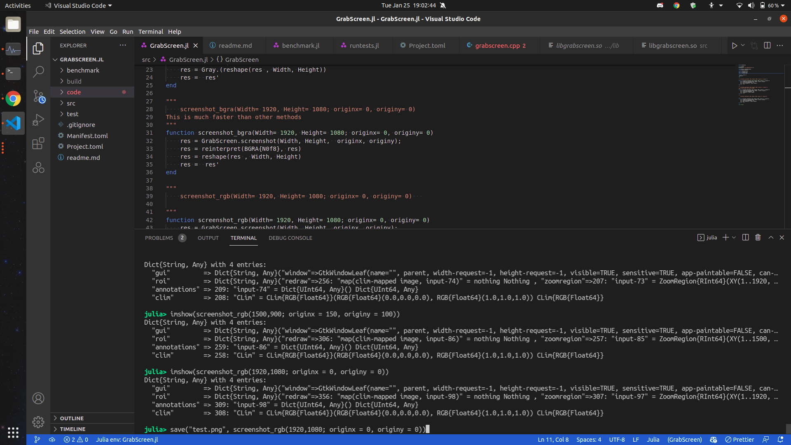

GrabScreen.jl

Helps to take screenshot using X11 in julia, can provide over 90 fps in BGRA format, 71fps in RGB format and 100 fps in GRAY format. 
Basically it can cater to real time needs

### Example


- `rgb.jl` : Example for VideoIO.jl, Makie.jl for screencapture using GrabScreen.jl which is almost realtime.

### Usage
There are 3 methods available i.e. screenshot_bgra(), screenshot_rgb(), screenshot_gray() with similiar parameters that are:

Parameters:

- `Width` : Width of the image
- `Height`: Height of the image
- `originx` : offset of the image in x direction(point where image starts in x direction)
- `originy` : offset of the image in y direction(point where image starts in y direction)

### Build Notes:
```
mkdir build && cd build
cmake -DCMAKE_BUILD_TYPE=Release -DCMAKE_PREFIX_PATH=/home/ashwani/OpenCV.jl/libcxxwrap-julia-build ../code
cmake --build . --config Release
```


